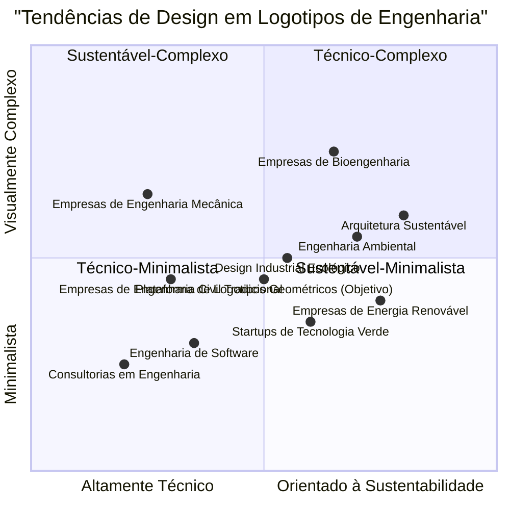

# Pesquisa de Mercado: Logotipos Geométricos para Empresas de Engenharia

## Sumário Executivo

Este relatório apresenta uma análise abrangente das tendências atuais em design de logotipos geométricos, com foco específico no setor de engenharia e sustentabilidade. A pesquisa visa fundamentar o desenvolvimento de uma plataforma de criação de logotipos geométricos voltada para empresas de engenharia e setores relacionados. Os achados destacam os principais estilos geométricos, suas aplicações, exemplos de como a geometria é usada para transmitir conceitos relevantes para engenharia e sustentabilidade, além de princípios de design essenciais como escalabilidade e impacto visual.

## 1. Principais Estilos Geométricos e suas Aplicações

### 1.1 Minimalismo Geométrico

O minimalismo geométrico continua sendo uma das tendências mais fortes em design de logotipos, especialmente para empresas de engenharia. Este estilo se caracteriza pelo uso de formas básicas como círculos, triângulos e quadrados em composições limpas e precisas.

**Aplicações**:
- Empresas de consultoria em engenharia que desejam transmitir precisão e eficiência
- Escritórios de arquitetura que valorizam a clareza e estrutura
- Startups de tecnologia que buscam uma identidade moderna e versátil

### 1.2 Composições Geométricas Abstratas

Este estilo utiliza múltiplas formas geométricas combinadas para criar logotipos distintos e memoráveis. A abstração permite interpretações variadas enquanto mantém a precisão técnica.

**Aplicações**:
- Empresas multidisciplinares de engenharia que integram diferentes áreas
- Empresas de inovação tecnológica que desejam destacar criatividade e pensamento avançado
- Empresas que buscam se diferenciar de competidores mais tradicionais

### 1.3 Geometria 3D e Isométrica

Logotipos que utilizam perspectiva para criar a ilusão de tridimensionalidade são particularmente eficazes para empresas de engenharia estrutural e civil.

**Aplicações**:
- Empresas de construção e engenharia civil que trabalham com estruturas físicas
- Desenvolvedores de software de modelagem 3D e CAD
- Empresas de engenharia industrial que fabricam produtos físicos

### 1.4 Geometria Linear e Monoline

Caracterizada pelo uso de linhas de espessura única para criar formas geométricas, esta abordagem transmite precisão, elegância e sofisticação técnica.

**Aplicações**:
- Empresas de engenharia de precisão e microeletrônica
- Consultorias em engenharia com foco em processos refinados
- Empresas de design industrial com estética minimalista

### 1.5 Formas Hexagonais e Padrões Repetitivos

Inspirados em estruturas naturais como colmeias, os designs baseados em hexágonos e padrões repetitivos estabelecem conexões visuais entre tecnologia e natureza.

**Aplicações**:
- Empresas de engenharia ambiental e sustentabilidade
- Empresas de biotecnologia e bioengenharia
- Organizações que desenvolvem materiais avançados baseados em estruturas naturais

### 1.6 Geometria com Espaço Negativo

Esta técnica explora o espaço não preenchido para criar significados adicionais ou formas secundárias dentro de um logotipo geométrico.

**Aplicações**:
- Empresas que valorizam a criatividade e o pensamento inovador
- Organizações que desejam comunicar múltiplas facetas de sua atividade
- Empresas que buscam designs memoráveis com camadas de significado

### 1.7 Geometria Orgânica

Combina formas geométricas precisas com elementos mais fluidos ou naturais, criando um equilíbrio entre rigidez técnica e organicidade.

**Aplicações**:
- Empresas de engenharia ambiental e ecológica
- Organizações focadas em design biofílico ou arquitetura sustentável
- Empresas que equilibram inovação tecnológica com preocupações ambientais

## 2. Exemplos de Como a Geometria Transmite Conceitos de Engenharia e Sustentabilidade

### 2.1 Estrutura e Estabilidade

**Exemplos Geométricos**:
- Triângulos e estruturas trianguladas são frequentemente usados para representar estabilidade estrutural, um conceito fundamental na engenharia civil.
- Grades e padrões reticulados evocam plantas baixas e estruturas arquitetônicas.
- Formas cúbicas e quadradas transmitem solidez e confiabilidade em projetos de engenharia.

**Aplicação Prática**: Empresas como a Interface Engineering utilizam formas geométricas simples em arranjos equilibrados para transmitir precisão e expertise técnica em seus logotipos.

### 2.2 Precisão e Medição

**Exemplos Geométricos**:
- Círculos concêntricos ou segmentados remetem a instrumentos de medição e precisão.
- Linhas paralelas em espaçamentos precisos sugerem escalas e réguas.
- Ângulos retos e formas perfeitamente alinhadas comunicam atenção meticulosa ao detalhe.

**Aplicação Prática**: Empresas de engenharia de precisão frequentemente incorporam elementos geométricos com alinhamento perfeito e proporções cuidadosamente calculadas em seus logotipos.

### 2.3 Movimento e Fluxo

**Exemplos Geométricos**:
- Formas circulares ou em espiral sugerem continuidade e movimento cíclico.
- Setas geométricas ou formas direcionais indicam progresso e avanço.
- Linhas diagonais paralelas criam sensação de velocidade e dinamismo.

**Aplicação Prática**: A 360 Engineering utiliza um elemento circular com flecha para representar sua abordagem holística, comunicando visão completa e movimento progressivo.

### 2.4 Sustentabilidade e Ciclos Naturais

**Exemplos Geométricos**:
- Círculos interligados ou em loop representam ciclos contínuos e economia circular.
- Espirais evocam crescimento natural e padrões regenerativos.
- Hexágonos e estruturas em colmeia conectam engenharia e padrões naturais eficientes.

**Aplicação Prática**: Empresas de engenharia ambiental frequentemente utilizam círculos que se completam ou hexágonos interconectados para simbolizar ciclos sustentáveis e integração com processos naturais.

### 2.5 Tecnologia e Inovação

**Exemplos Geométricos**:
- Formas geométricas parcialmente fragmentadas ou pixelizadas sugerem digitalização e tecnologia.
- Estruturas em rede ou malha representam conectividade e sistemas inteligentes.
- Designs modulares com elementos interconectados simbolizam integração tecnológica.

**Aplicação Prática**: Empresas como a CAD LAB utilizam padrões geométricos que instantaneamente comunicam expertise técnica em design auxiliado por computador.

### 2.6 Energia e Eficiência

**Exemplos Geométricos**:
- Triangulações que sugerem painéis solares ou turbinas eólicas estilizadas.
- Formas radiais que evocam distribuição de energia ou irradiação.
- Linhas diagonais ascendentes que transmitem energia e potência crescente.

**Aplicação Prática**: Empresas de energia renovável frequentemente incorporam elementos geométricos que sugerem fontes de energia (sol, vento, água) em formatos geometricamente estilizados.

### 2.7 Conexão e Integração

**Exemplos Geométricos**:
- Pontos conectados por linhas simbolizando redes e colaboração.
- Formas entrelaçadas ou sobrepostas representando integração de sistemas.
- Elementos modulares que se encaixam perfeitamente demonstrando complementaridade.

**Aplicação Prática**: A Integral Engineering utiliza um ícone cúbico que incorpora conexões internas, simbolizando abordagens integradas para solução de problemas.

## 3. Princípios de Design para Logotipos Geométricos

### 3.1 Simplicidade e Clareza

A eficácia de logotipos geométricos para empresas de engenharia depende fundamentalmente de sua simplicidade. Designs que eliminam elementos desnecessários e focam em formas essenciais comunicam identidade de marca com clareza e facilitam o reconhecimento imediato.

**Implicações Práticas**:
- Priorize formas geométricas básicas e combinações simples
- Evite detalhes excessivos que comprometam a legibilidade em tamanhos menores
- Busque o equilíbrio entre simplicidade e distinção para criar uma identidade memorável

### 3.2 Escalabilidade

Um dos principais benefícios dos logotipos geométricos é sua escalabilidade inerente, característica crucial para empresas que aplicarão sua marca em diversos contextos, desde pequenos ícones digitais até grandes sinalizações.

**Diretrizes**:
- Comece com uma base geométrica simples que funcione bem em tamanhos reduzidos
- Teste regularmente o design em múltiplas dimensões durante o processo de criação
- Desenvolva um sistema modular que permita diferentes versões do logotipo (ícone simplificado, marca completa) conforme necessário
- Mantenha consistência no peso visual dos elementos em diferentes escalas

### 3.3 Equilíbrio Visual e Proporção

Logotipos geométricos eficazes mantêm proporções cuidadosamente calculadas e equilíbrio visual entre elementos, criando harmonia que naturalmente atrai o olhar e causa uma impressão duradoura.

**Considerações**:
- Utilize sistemas de grade para garantir alinhamento e proporções precisas
- Equilibre adequadamente o espaço positivo e negativo
- Considere princípios clássicos como a proporção áurea para criar relações harmônicas entre elementos

### 3.4 Uso Estratégico de Cores

Embora logotipos geométricos funcionem excelentemente em preto e branco, escolhas estratégicas de cores podem amplificar seu impacto e transmitir mensagens adicionais sobre a marca.

**Paletas Dominantes no Setor de Engenharia**:
- **Azul**: Confiança, estabilidade e competência técnica
- **Verde**: Sustentabilidade, inovação ecológica e responsabilidade ambiental
- **Cinza/Prata**: Profissionalismo, precisão e tecnologia avançada
- **Cores terrosas**: Conexão com materiais naturais e abordagens sustentáveis

**Recomendações**:
- Limite a paleta a 2-3 cores para manter a simplicidade
- Garanta que o logotipo funcione bem em versão monocromática
- Considere o simbolismo das cores no contexto específico do setor de engenharia

### 3.5 Versatilidade e Adaptabilidade

Logotipos para empresas de engenharia devem funcionar em diversos contextos, desde documentação técnica até materiais de marketing digital.

**Práticas Recomendadas**:
- Desenvolva variantes do logotipo para diferentes aplicações (horizontal, vertical, apenas ícone)
- Assegure que o design funcione bem tanto em fundos claros quanto escuros
- Crie versões simplificadas para usos que exijam alta legibilidade em tamanhos reduzidos

### 3.6 Significado e Alinhamento com Valores da Marca

Além da estética, logotipos geométricos para empresas de engenharia devem comunicar valores fundamentais e diferenciais competitivos.

**Considerações**:
- Escolha formas que reflitam os princípios fundamentais da empresa (inovação, precisão, sustentabilidade)
- Considere como o logotipo se relaciona com a história e visão da empresa
- Avalie se o estilo geométrico escolhido representa adequadamente o setor específico de engenharia

### 3.7 Atemporalidade sobre Tendências

Empresas de engenharia geralmente buscam estabelecer reputação de longo prazo e confiabilidade, tornando a atemporalidade um aspecto crucial do design de seus logotipos.

**Diretrizes**:
- Priorize soluções geométricas clássicas e duradouras
- Evite efeitos visuais excessivamente modernos ou tendências passageiras
- Busque equilíbrio entre contemporaneidade e longevidade

## 4. Análise Competitiva: Logotipos no Setor de Engenharia

### 4.1 Tendências Dominantes no Setor

A análise de logotipos de empresas de engenharia bem estabelecidas revela algumas tendências consistentes:

- **Predominância de Formas Geométricas**: A grande maioria das empresas de engenharia utiliza formas geométricas como base de seus logotipos, com ênfase em triângulos, círculos e hexágonos.

- **Minimalismo Crescente**: Existe uma tendência clara de simplificação, com empresas modernizando seus logotipos ao remover detalhes excessivos em favor de designs mais limpos e geométricos.

- **Dualidade Técnico-Natural**: Especialmente em empresas de engenharia sustentável, observa-se a combinação de elementos geométricos precisos com sugestões sutis de formas naturais.

- **Cores Profissionais**: Predominância de azuis, verdes e tons neutros, com uso ocasional de cores de destaque para elementos específicos do logotipo.

### 4.2 Exemplos Notáveis e Lições

**Grandes Corporações de Engenharia**:
- Utilizam frequentemente símbolos geométricos abstratos que podem representar múltiplos campos de atuação
- Priorizam designs duradouros e reconhecíveis sobre tendências passageiras
- Mantêm consistência visual rigorosa em todas as aplicações

**Startups Inovadoras**:
- Tendem a utilizar geometria mais dinâmica e contemporânea
- Incorporam elementos que sugerem tecnologia avançada e disrupção
- Frequentemente combinam formas geométricas precisas com tipografia moderna

**Empresas de Engenharia Sustentável**:
- Sintetizam elementos geométricos com simbolismo ambiental
- Utilizam mais frequentemente formas circulares e ciclos
- Adotam paletas de cores que evocam natureza e sustentabilidade

## 5. Conclusões e Recomendações

### 5.1 Principais Insights

- Os logotipos geométricos continuam sendo a escolha predominante para empresas de engenharia devido à sua capacidade de comunicar precisão, confiabilidade e expertise técnica.

- A simplicidade e escalabilidade são características fundamentais para logotipos eficazes neste setor, permitindo aplicação consistente em diversos contextos.

- Existe uma tendência crescente de incorporar sutilmente elementos que sugerem sustentabilidade e responsabilidade ambiental, mesmo mantendo a base geométrica e técnica.

- As empresas de engenharia estão cada vez mais conscientes do valor de um design de marca profissional e distintivo como ferramenta de diferenciação competitiva.

### 5.2 Recomendações para o Desenvolvimento da Plataforma

1. **Diversidade de Estilos Base**: Desenvolver ícones geométricos que representem diferentes abordagens (minimalista, abstrata, 3D/isométrica, linear) para atender às diversas necessidades do setor.

2. **Simbolismo Técnico e Sustentável**: Criar ícones que possam transmitir tanto expertise técnica quanto comprometimento com sustentabilidade através de geometria cuidadosamente projetada.

3. **Modularidade e Customização**: Priorizar um sistema que permita personalização suficiente para criar identidades únicas, mantendo a integridade geométrica dos designs base.

4. **Ferramentas de Escalabilidade**: Incluir funcionalidades que permitam visualizar e otimizar o logotipo em diferentes tamanhos e aplicações.

5. **Paletas Harmonizadas**: Oferecer paletas de cores pré-definidas que funcionem bem para o setor de engenharia, incluindo opções sustentáveis/ambientais e opções mais técnicas/corporativas.

6. **Educação de Design**: Incorporar diretrizes e melhores práticas para auxiliar usuários sem experiência em design a criar logotipos geométricos eficazes e profissionais.

Esta pesquisa de mercado fornece uma base sólida para o desenvolvimento de uma plataforma de criação de logotipos geométricos que atenda às necessidades específicas de empresas de engenharia e sustentabilidade, combinando princípios de design fundamentais com tendências contemporâneas relevantes para o setor.

## 6. Quadrante Competitivo: Análise Visual de Logotipos Geométricos em Engenharia

A análise a seguir mapeia diferentes abordagens de design de logotipos geométricos encontrados no setor de engenharia, considerando duas dimensões principais: Complexidade Visual (de Minimalista a Detalhado) e Orientação Temática (de Técnico a Sustentável/Natural).

**Observações sobre o Quadrante:**

- **Quadrante Técnico-Minimalista**: Predominam empresas de consultoria e software, que tendem a usar formas geométricas puras e minimalistas para comunicar precisão e confiabilidade.

- **Quadrante Técnico-Complexo**: Típico de empresas de engenharia mecânica e manufatura, com logotipos que apresentam maior complexidade visual para demonstrar capacidade técnica.

- **Quadrante Sustentável-Minimalista**: Empresas de energia renovável e startups verdes frequentemente adotam abordagens visuais mais simples, porém com clara orientação para sustentabilidade.

- **Quadrante Sustentável-Complexo**: Empresas de bioengenharia e arquitetura sustentável tendem a usar geometria mais elaborada para comunicar tanto capacidade técnica quanto compromisso ambiental.

- **Posicionamento Ideal da Plataforma**: No centro do diagrama, capaz de atender diversos segmentos do mercado de engenharia, oferecendo flexibilidade para criar logos que se posicionem em qualquer quadrante conforme a necessidade do cliente.
