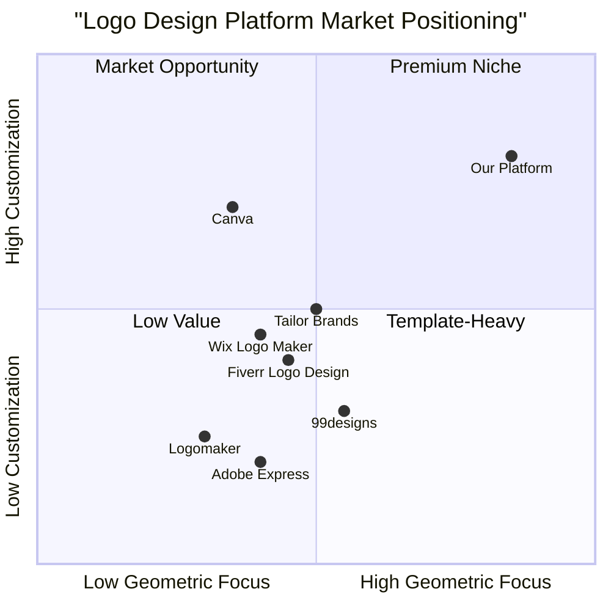

# Product Requirements Document (PRD)

## Geometric Logo Creation Platform for Engineering and Sustainability Sectors

*Prepared by: Emma, Product Manager*
*Date: May 20, 2025*

---

## Table of Contents

1. [Executive Summary](#1-executive-summary)
2. [Product Overview](#2-product-overview)
3. [Target Audience Analysis](#3-target-audience-analysis)
4. [User Requirements](#4-user-requirements)
5. [Product Features and Specifications](#5-product-features-and-specifications)
6. [Base Geometric Icons Specifications](#6-base-geometric-icons-specifications)
7. [User Flow and Interface Design](#7-user-flow-and-interface-design)
8. [Editing Capabilities Requirements](#8-editing-capabilities-requirements)
9. [Typography Integration](#9-typography-integration)
10. [Export Functionality](#10-export-functionality)
11. [Technical Requirements](#11-technical-requirements)
12. [Success Metrics](#12-success-metrics)
13. [Future Considerations](#13-future-considerations)
14. [Appendix](#14-appendix)

---

## 1. Executive Summary

The Geometric Logo Creation Platform is a specialized web application designed to enable businesses in the engineering and sustainability sectors to create professional, customizable geometric logos that effectively communicate their brand values. Based on comprehensive market research, this platform addresses a significant gap in the market for highly customizable geometric logo creation tools specifically tailored to technical and environmentally-conscious industries.

The platform will offer 10 foundational geometric icons based on research-backed design principles, along with robust editing capabilities, typography integration, and export options. By focusing on the unique needs of engineering and sustainability sectors, the platform will provide a valuable tool for businesses seeking to establish a strong visual identity that communicates precision, innovation, and environmental consciousness.

---

## 2. Product Overview

### 2.1 Product Vision

To become the premier logo creation platform for engineering and sustainability-focused businesses by providing specialized geometric design tools that communicate technical precision and environmental values.

### 2.2 Product Goals

1. Enable users without design expertise to create professional, geometric logos optimized for engineering and sustainability sectors
2. Provide highly customizable geometric templates that maintain design integrity while allowing for brand personalization
3. Deliver an intuitive user experience that follows the natural logo creation workflow from base selection to final export

### 2.3 Value Proposition

The platform offers specialized geometric designs and customization tools specifically tailored for engineering and sustainability sectors—a market gap identified in our research. Users can create distinctive, professional logos that effectively communicate their brand values without requiring advanced design skills or expensive custom design services.

## 3. Target Audience Analysis

Based on market research findings, the platform targets the following primary user segments:

### 3.1 Primary User Segments

#### Engineering Firms

- **Size Range**: Small boutique firms to large multinational companies
- **Subsectors**: Civil, Mechanical, Electrical, Chemical, Aerospace Engineering
- **Key Motivations**: Creating logos that convey technical precision, reliability, and innovation
- **Design Preferences**: Angular geometry, mathematical precision, clean lines
- **Color Preferences**: Technical blue palettes (#0B3C5D, #328CC1) and engineering gray palettes (#4F6272, #B7C3F3)

#### Sustainability Sector Organizations

- **Size Range**: Startups to established organizations
- **Subsectors**: Renewable Energy, Green Construction, Sustainable Tech, Conservation, Circular Economy
- **Key Motivations**: Communicating environmental values, innovation, and future-forward thinking
- **Design Preferences**: Circular forms, fluid geometry, organic-technical balance
- **Color Preferences**: Eco green (#2A9D8F, #E9C46A) and sustainable earth palettes (#606C38, #283618)

#### Clean Technology Companies

- **Size Range**: Early-stage startups to growth-phase companies
- **Subsectors**: Clean Energy, Smart Devices, Sustainable Manufacturing
- **Key Motivations**: Expressing technological innovation with environmental consciousness
- **Design Preferences**: Hybrid geometric forms blending technical precision with natural inspiration
- **Color Preferences**: Clean energy palettes (#457B9D, #A8DADC) with technical accents

#### STEM/Environmental Educational Institutions

- **Size Range**: Departments to full institutions
- **Subsectors**: Engineering Schools, Environmental Science Programs, Research Centers
- **Key Motivations**: Communicating academic rigor with forward-thinking values
- **Design Preferences**: Knowledge-suggesting geometry (interconnected systems, structural integrity)
- **Color Preferences**: Blend of academic tradition with innovation-signaling colors

### 3.2 User Personas

#### Persona 1: Technical Director at Engineering Firm

- **Name**: Robert Chen
- **Role**: Technical Director at mid-sized civil engineering firm
- **Technical Skills**: High technical expertise, limited graphic design experience
- **Goals**: Create a professional logo that positions the firm as innovative yet reliable
- **Pain Points**: Limited design budget, needs quick solution that still appears custom
- **Success Criteria**: Logo that works well on technical documents and digital platforms

#### Persona 2: Founder of Sustainability Startup

- **Name**: Sophia Garcia
- **Role**: Founder/CEO of renewable energy consulting startup
- **Technical Skills**: Business expertise, basic design understanding
- **Goals**: Establish brand identity that communicates environmental values without appearing "too green"
- **Pain Points**: Needs professional branding on limited startup budget
- **Success Criteria**: Distinctive logo that connects with both corporate clients and eco-conscious consumers

---

## 4. User Requirements

Based on market research and target audience analysis, the platform must address the following key user requirements:

### 4.1 Functional Requirements

#### Must Have

1. **Specialized Geometric Templates**: Provide industry-specific foundational geometric forms tailored to engineering and sustainability sectors
2. **Comprehensive Customization**: Allow precise modification of geometric elements including shape, size, proportion, and orientation
3. **Professional Typography Integration**: Enable addition and customization of company name and optional tagline
4. **Color System**: Offer sector-specific color palettes with full customization capabilities
5. **Multi-Format Export**: Provide downloads in both vector (SVG) and raster (PNG) formats
6. **Variant Generation**: Automatically create logo variations for different applications (horizontal, vertical, icon-only)

#### Should Have

1. **Guided Creation Process**: Step-by-step interface guiding users from selection to final export
2. **Preview Capabilities**: Show real-time previews of logos in different contexts and applications
3. **Responsive Design**: Function effectively across desktop and tablet devices
4. **Basic Logo Animation**: Simple animation options for digital applications
5. **Design Principles Guidance**: Tooltips and suggestions for best practices in geometric logo design

#### May Have

1. **Advanced Geometry Tools**: More complex geometric manipulations for advanced users
2. **Template Gallery**: Expanded library of sector-specific starting points
3. **Collaboration Features**: Sharing and feedback tools for team input
4. **Extended Export Options**: Additional file formats and specification options

### 4.2 Non-Functional Requirements

#### Performance

1. **Speed**: Logo editor must respond to changes in real-time without noticeable lag
2. **Reliability**: Platform must maintain all user customizations throughout the creation process
3. **Browser Compatibility**: Must work flawlessly on Chrome, Firefox, Safari, and Edge

#### Usability

1. **Intuitiveness**: Users should be able to create a basic logo within 10 minutes without tutorial
2. **Accessibility**: Meet WCAG 2.1 AA standards for accessibility
3. **Error Prevention**: Provide clear guidance and prevent design choices that would result in poor logo outcomes

#### Security

1. **Data Protection**: Secure handling of user-created designs
2. **Privacy**: Clear policies on data usage and ownership

### 4.3 User Goals and Outcomes

1. **Create a Professional Logo**: Users should be able to produce logos that appear professionally designed
2. **Communicate Brand Values**: Logos should effectively convey technical precision and/or sustainability values
3. **Multiple Applications**: Final logo should function across digital and print applications
4. **Time Efficiency**: Complete logo creation process should take less than 30 minutes
5. **Cost Effectiveness**: Platform should provide professional results at significantly lower cost than custom design

## 5. Product Features and Specifications

### 5.1 Core Platform Components

#### 5.1.1 Logo Base Selection Module

- Library of 10 foundational geometric icons specifically designed for engineering and sustainability sectors
- Categorization by industry relevance and symbolic meaning
- Preview functionality showing each base icon in different color variations
- Quick-view information about the symbolic meaning and typical applications of each geometric form

#### 5.1.2 Geometric Editor Module

- Comprehensive editing tools for customizing the selected base geometric icon
- Component selection functionality for manipulating individual elements within complex geometric forms
- Geometric transformation tools (resize, rotate, reposition, etc.)
- Color customization with sector-specific palettes and custom color options
- Line weight and style adjustments
- Shape combination and Boolean operations (where applicable)

#### 5.1.3 Typography Module

- Curated font selection appropriate for engineering and sustainability sectors
- Text placement and formatting options
- Font size, weight, spacing, and color adjustments
- Brand name and optional tagline fields
- Typography arrangement options (horizontal, vertical, circular)

#### 5.1.4 Preview and Export Module

- Real-time preview in different contexts (website header, business card, social media profile)
- Automatic generation of logo variants (full logo, icon only, wordmark only)
- Multi-format export options (SVG, PNG with transparency)
- Color variations preview (full color, monochrome, reversed)

### 5.2 Feature Details

#### 5.2.1 User Account and Projects

- Basic account creation and management
- Project saving and retrieval
- Project history and versioning
- Private logo library

#### 5.2.2 Customization Controls

- Precise geometric adjustments with numerical inputs
- Snap-to-grid and alignment tools
- Smart guides for maintaining design integrity
- Color harmony suggestions
- Undo/redo functionality with history

#### 5.2.3 Design Guidance

- Contextual tips for effective geometric logo design
- Industry-specific best practices
- Warning system for potential design issues
- Logo evaluation tool based on design principles

---

## 6. Base Geometric Icons Specifications

Based on market research findings, the platform will offer 10 foundational geometric icons, each with specific symbolic relevance to engineering and sustainability sectors:

### 6.1 Base Icon Set

#### 6.1.1 Perfect Circle (Unity)

**Description**: A mathematically perfect circle representing unity, completeness, and continuous cycles.

**Technical Specifications**:
- Perfect circular geometry with consistent stroke weight
- Optional concentric circle variations
- Customizable center point marker

**Sector Relevance**:
- Renewable energy (solar, circular economy)
- Environmental consulting (holistic approaches)
- Systems engineering (complete solutions)

**Customization Parameters**:
- Stroke weight and style
- Optional inner elements
- Degree of circle completion (full, partial)

#### 6.1.2 Square/Rectangle (Stability)

**Description**: Clean, angular forms representing stability, reliability, and structural integrity.

**Technical Specifications**:
- Perfect right angles and parallel sides
- Options for square or rectangular proportions
- Golden ratio rectangle option

**Sector Relevance**:
- Civil engineering (structural stability)
- Architecture (built environment)
- Manufacturing (precision)

**Customization Parameters**:
- Proportions and dimensions
- Corner radius options
- Inner division lines

#### 6.1.3 Triangle (Direction)

**Description**: Angular three-point form suggesting direction, progress, and structural strength.

**Technical Specifications**:
- Equilateral, isosceles, and right-angle triangle options
- Precise angle measurements
- Orientation controls

**Sector Relevance**:
- Structural engineering (force distribution)
- Energy efficiency (directional flow)
- Project management (progress)

**Customization Parameters**:
- Triangle type and angles
- Orientation and direction
- Vertex emphasis

#### 6.1.4 Hexagon (Efficiency)

**Description**: Six-sided polygon representing efficiency, natural structure, and interconnection.

**Technical Specifications**:
- Perfect geometric hexagon
- Optional honeycomb pattern variations
- Inner structure options

**Sector Relevance**:
- Chemical engineering (molecular structures)
- Sustainable architecture (efficient use of space)
- Environmental technology (natural systems)

**Customization Parameters**:
- Size and proportion
- Inner geometric divisions
- Connection points for pattern creation

#### 6.1.5 Spiral (Growth)

**Description**: Logarithmic or Archimedean spiral representing growth, evolution, and natural development.

**Technical Specifications**:
- Mathematically precise spiral forms
- Golden ratio spiral option
- Customizable start and end points

**Sector Relevance**:
- Sustainable development (progressive growth)
- Evolutionary engineering
- Biomimicry applications

**Customization Parameters**:
- Spiral type and tightness
- Number of rotations
- Start and end treatment

#### 6.1.6 Grid Pattern (Organization)

**Description**: Intersecting lines forming structured patterns representing organization, systems, and frameworks.

**Technical Specifications**:
- Perfectly aligned grid lines
- Variable density and spacing
- Optional focal points

**Sector Relevance**:
- Electrical engineering (circuits)
- Urban planning (infrastructure)
- Systems engineering (connections)

**Customization Parameters**:
- Grid density and spacing
- Line weight variations
- Dimensional emphasis (horizontal/vertical)

#### 6.1.7 Intersecting Lines (Connectivity)

**Description**: Strategic line intersections suggesting connectivity, integration, and network systems.

**Technical Specifications**:
- Precise angle intersections
- Node emphasis options
- Directional flow indicators

**Sector Relevance**:
- Network engineering
- Transportation systems
- Resource management

**Customization Parameters**:
- Intersection angles and positions
- Node/junction styling
- Line quality and direction

#### 6.1.8 Fluid Curve (Adaptation)

**Description**: Flowing curved lines suggesting adaptation, movement, and dynamic systems.

**Technical Specifications**:
- Mathematically smooth Bézier curves
- Variable thickness options
- Multi-curve integration

**Sector Relevance**:
- Fluid dynamics engineering
- Environmental adaptation technologies
- Ergonomic design

**Customization Parameters**:
- Curve tension and flow
- Thickness variation
- Endpoint treatment

#### 6.1.9 Fractal (Scalability)

**Description**: Self-repeating geometric pattern suggesting scalability, complexity, and natural structures.

**Technical Specifications**:
- Simplified fractal patterns with controllable iterations
- Perfect mathematical proportions
- Scaled element relationships

**Sector Relevance**:
- Sustainability (multi-level solutions)
- Complex systems engineering
- Environmental modeling

**Customization Parameters**:
- Iteration depth
- Pattern density
- Base geometric form

#### 6.1.10 Biomorphic Form (Nature-Tech Balance)

**Description**: Geometric abstraction of natural forms representing harmony between technology and nature.

**Technical Specifications**:
- Organic curves with geometric precision
- Nature-inspired patterns with technical execution
- Balanced asymmetry

**Sector Relevance**:
- Sustainable design
- Biomimicry engineering
- Environmental technology

**Customization Parameters**:
- Balance between organic and geometric elements
- Symmetry controls
- Form complexity

### 6.2 Icon Development Guidelines

- All base icons must be created as scalable vector graphics
- Icons must maintain clarity at minimum size of 16×16 pixels
- Each icon must be modular with separately editable components
- All geometric proportions must be mathematically precise
- Icons must work effectively in both positive and negative space
- Each icon should allow meaningful customization while maintaining design integrity

---

## 7. User Flow and Interface Design

### 7.1 Primary User Flow

The platform's core user flow follows a natural progression from selection to export:

#### Step 1: Base Icon Selection

**User Actions**:
- Browse through the 10 base geometric icons
- View each icon with industry relevance information
- Select icon for customization

**UI Components**:
- Visual icon gallery with filter options
- Information panel with symbolic meaning and applications
- Quick view in different base colors
- Selection confirmation and "start customizing" button

#### Step 2: Geometric Editing

**User Actions**:
- Select individual geometric components within the base icon
- Apply transformations (resize, rotate, reposition)
- Adjust shape properties (stroke weight, corner radius, etc.)
- Modify colors using pre-set palettes or custom colors
- Add or remove geometric elements (where applicable)

**UI Components**:
- Central canvas with selected icon
- Component selection tools
- Transformation controls (visual and numerical)
- Color palette selector with industry-specific options
- Property panel for active element
- Undo/redo controls

#### Step 3: Typography Addition

**User Actions**:
- Toggle typography addition feature
- Enter company name and optional tagline
- Select font from curated list
- Adjust typography properties (size, weight, spacing)
- Position text relative to icon (below, beside, integrated)
- Set text color and treatment

**UI Components**:
- Text input fields for company name and tagline
- Font selector with appropriate categories
- Typography controls panel
- Text positioning templates
- Preview of text with icon

#### Step 4: Preview and Export

**User Actions**:
- View logo in different contexts and applications
- Review automatically generated variants
- Select preferred variant(s) for export
- Choose export format(s) and options
- Download final logo files

**UI Components**:
- Context preview carousel (website, business card, app icon, etc.)
- Variant display grid (full logo, icon only, text only)
- Format selector with explanation of use cases
- Download button with format options
- "Save to account" option

### 7.2 Secondary User Flows

#### Account Management Flow

- Account creation/login
- Project saving and retrieval
- Settings management
- Subscription handling (if applicable)

#### Logo Library Management

- Viewing saved logos
- Duplicating existing logos for variations
- Organizing logos by project
- Sharing logos with team members (future feature)

### 7.3 Interface Design Principles

- **Clean Workspace**: Minimalist interface focusing on the logo being created
- **Contextual Controls**: Only show relevant tools for current editing stage
- **Progressive Disclosure**: Reveal advanced features as users master basics
- **Visual Feedback**: Provide immediate feedback for all user actions
- **Consistent Layout**: Maintain consistent positioning of common elements
- **Responsive Design**: Adapt to different screen sizes while maintaining usability
- **Accessibility**: Ensure all features are accessible to users with disabilities

## 8. Editing Capabilities Requirements

### 8.1 Component Selection and Manipulation

#### 8.1.1 Selection Mechanisms

- **Direct Selection**: Ability to select individual geometric elements within composite icons
- **Group Selection**: Option to select multiple components simultaneously
- **Layer Selection**: Component selection via organized layer panel
- **Smart Selection**: Intelligent selection of related components

#### 8.1.2 Transformation Controls

- **Resize**: Proportional and non-proportional scaling with numeric precision
- **Rotate**: Rotation around center point or custom anchor with degree control
- **Move**: Precise positioning with pixel-level control and alignment guides
- **Flip**: Horizontal and vertical mirroring options
- **Scale**: Uniform and non-uniform scaling with reference point selection

#### 8.1.3 Component Modification

- **Path Editing**: Direct manipulation of vector paths for advanced users
- **Corner Control**: Adjustable corner radius for angular shapes
- **Line Properties**: Stroke weight, cap style, and join style adjustments
- **Node Editing**: Addition, removal, and manipulation of path nodes
- **Proportional Controls**: Maintain mathematical relationships between components

### 8.2 Color Customization

#### 8.2.1 Color Selection Methods

- **Industry-Specific Palettes**: Pre-defined color schemes based on sector research
- **Custom Color Picker**: RGB, HEX, and HSL color selection
- **Color Harmonies**: Automatic complementary and analogous color suggestions
- **Saved Brand Colors**: Ability to save and reuse custom colors
- **Eyedropper Tool**: Sample colors from uploaded reference images

#### 8.2.2 Color Application Options

- **Fill Controls**: Solid fill, gradient options (linear, radial)
- **Stroke Controls**: Independent stroke color selection
- **Opacity Settings**: Transparency controls for both fill and stroke
- **Global Color Changes**: Apply color changes to multiple elements simultaneously
- **Color Variants**: Generate monochromatic, black, and white versions

### 8.3 Advanced Editing Features

#### 8.3.1 Shape Operations

- **Boolean Operations**: Unite, subtract, intersect, and exclude shapes
- **Shape Combination**: Merge separate geometric elements
- **Shape Division**: Split compound shapes into component parts
- **Alignment Tools**: Distribute, center, and align multiple elements
- **Spacing Controls**: Equal distribution of elements with precise spacing

#### 8.3.2 Special Effects

- **Shadow Options**: Simple drop shadow with customizable offset and blur
- **Glow Effects**: Subtle inner or outer glow for emphasis
- **Transparency Effects**: Opacity adjustments for overlapping elements
- **Layer Blending**: Basic blending modes for overlapping shapes

#### 8.3.3 Grid and Guides

- **Snap-to-Grid**: Customizable grid with snap functionality
- **Smart Guides**: Dynamic guides for alignment and spacing
- **Ruler Systems**: Toggle rulers with measurement units
- **Guide Management**: Add, remove, and lock custom guides

---

## 9. Typography Integration

### 9.1 Font Selection

#### 9.1.1 Curated Typography Collection

- **Engineering-Focused Fonts**: Clean, technical sans-serif options (minimum 10)
  - Examples: Montserrat, Roboto, Open Sans, Raleway, Titillium Web
- **Sustainability-Focused Fonts**: Balanced, contemporary options (minimum 10)
  - Examples: Poppins, Work Sans, Nunito, Source Sans Pro, Lato
- **Font Categories**: Grouped by style characteristics (geometric, humanist, etc.)
- **Font Pairing Suggestions**: Recommended combinations for primary and secondary text

#### 9.1.2 Font Licensing

- All included fonts must be open-source or properly licensed for commercial use
- Clear attribution and licensing information available to users
- Documentation regarding usage rights in exported files

### 9.2 Text Configuration

#### 9.2.1 Text Fields

- **Primary Text**: Company/organization name field
- **Secondary Text**: Optional tagline/slogan field
- **Text Variations**: Automatic generation of initials or shortened versions
- **Character Limits**: Appropriate constraints with warnings for optimal design

#### 9.2.2 Typography Controls

- **Size Adjustment**: Precise font size control with responsive scaling
- **Weight Selection**: Variable font weight options where available
- **Spacing Controls**: Letter spacing, line height, and word spacing
- **Case Options**: ALL CAPS, Title Case, lowercase transformations
- **Style Variations**: Regular, italic, bold, condensed (as available per font)
- **Alignment Options**: Left, center, right, and justified text alignment

### 9.3 Text Positioning

#### 9.3.1 Layout Templates

- **Standard Arrangements**: Common text-icon relationships
  - Horizontal (text beside icon)
  - Vertical/Stacked (text below or above icon)
  - Integrated (text within or overlapping geometric elements)
  - Circular (text following arc around circular elements)
- **Spacing Relationships**: Proportional spacing between text and icon elements
- **Responsive Behavior**: Automatic adjustments for different display contexts

#### 9.3.2 Custom Positioning

- **Free Positioning**: Manual placement of text relative to geometric elements
- **Rotation Options**: Text orientation adjustments
- **Text on Path**: Option to flow text along geometric paths
- **Text Frame**: Constrain text within defined boundaries

### 9.4 Typography Styling

#### 9.4.1 Visual Treatments

- **Color Controls**: Independent color selection for text elements
- **Stroke Options**: Text outline with weight control
- **Background Elements**: Optional containing shapes behind text
- **Contrast Checking**: Automatic warnings for legibility issues

#### 9.4.2 Typography Best Practices

- **Contextual Guidance**: Industry-specific typography recommendations
- **Size Hierarchy**: Suggested size relationships between primary and secondary text
- **Legibility Warnings**: Alerts for potential readability issues
- **Balance Indicators**: Visual feedback on text-icon balance

---

## 10. Export Functionality

### 10.1 File Format Options

#### 10.1.1 Vector Formats

- **SVG (Primary)**: Scalable Vector Graphics format with embedded metadata
- **PDF**: Multi-page document with variant layouts
- **EPS**: Additional vector format for compatibility with older software
- **AI**: Optional Adobe Illustrator format (where licensing permits)

#### 10.1.2 Raster Formats

- **PNG**: Transparent background with customizable resolution
- **JPG**: Background color options with quality settings
- **WebP**: Optimized web format with compression options

### 10.2 Export Presets

#### 10.2.1 Web and Digital Usage

- **Favicon Package**: Icon variants sized for browser tabs, bookmarks
- **Social Media Profile**: Pre-sized assets for major platforms
- **Email Signature**: Optimized for email client display
- **Website Assets**: Header, footer, and general web usage formats

#### 10.2.2 Print Usage

- **Business Card**: High-resolution assets for print production
- **Stationery**: Letterhead, envelope, and business document formats
- **Signage**: Large format with appropriate resolution
- **Marketing Materials**: Standard sizes for brochures and promotional items

### 10.3 Export Variants

#### 10.3.1 Logo Variations

- **Primary Logo**: Full version with icon and typography
- **Symbol Only**: Isolated geometric icon without text
- **Wordmark Only**: Typography without geometric icon
- **Horizontal Layout**: Optimized for website headers and signatures
- **Vertical/Stacked Layout**: Optimized for profile pictures and square contexts
- **Responsive Variants**: Simplified versions for small display contexts

#### 10.3.2 Color Variations

- **Full Color**: Standard version with complete color specifications
- **Monochromatic**: Single-color versions in brand colors
- **Black**: Solid black version for standard printing
- **White/Reversed**: White version for dark backgrounds
- **Grayscale**: Gradient black version with appropriate contrast

### 10.4 Brand Guidelines Generation

- **Basic Usage Rules**: Automated generation of spacing and sizing guidelines
- **Color Specifications**: Hex, RGB, CMYK values for selected colors
- **Clear Space Definition**: Visualization of required logo padding
- **Minimum Size Requirements**: Documentation of smallest recommended usage
- **Do's and Don'ts**: Basic usage recommendations

---

## 11. Technical Requirements

### 11.1 Development Specifications

- **Frontend**: React, JavaScript and Tailwind CSS
- **Vector Graphics**: SVG manipulation libraries
- **Responsive Design**: Support for desktop and tablet devices
- **Browser Support**: Chrome, Firefox, Safari, Edge (latest two versions)
- **Performance Optimization**: Efficient rendering for complex geometric manipulation

### 11.2 Infrastructure Requirements

- **Cloud Hosting**: Scalable infrastructure with CDN integration
- **Authentication System**: Secure user account management
- **Database**: Project storage and retrieval
- **Asset Management**: Efficient handling of font and template resources

### 11.3 Security Considerations

- **User Data Protection**: Secure handling of account information
- **Design Protection**: Private storage of user-created logos
- **Payment Processing**: Secure handling of subscription/payment information
- **Access Controls**: Permission-based access to shared logo projects

---

## 12. Success Metrics

### 12.1 User Engagement Metrics

- **Completion Rate**: Percentage of users who complete the logo creation process
- **Time to Completion**: Average time to create a finished logo
- **Feature Utilization**: Usage statistics for different editing tools
- **Return Rate**: Percentage of users creating multiple logos or revisions

### 12.2 Quality Metrics

- **Export Rate**: Percentage of sessions resulting in logo export
- **Variant Usage**: Statistics on which logo variants are most exported
- **Customer Satisfaction**: User ratings and feedback scores
- **Design Diversity**: Analysis of unique combinations vs. template adherence

### 12.3 Business Metrics

- **User Acquisition**: New account creation rate
- **Conversion Rate**: Free to paid conversion (if applicable)
- **Retention**: Monthly active users and retention curves
- **Revenue**: Subscription/purchase metrics (if applicable)

---

## 13. Future Considerations

### 13.1 Potential Feature Expansions

- **Mobile Support**: Adaptation for smartphone interfaces
- **AI-Assisted Design**: Smart suggestions based on industry and preferences
- **Animation Tools**: Basic logo animation capabilities for digital media
- **Enhanced Collaboration**: Team-based logo design and feedback
- **Extended Template Library**: Additional geometric base forms
- **Advanced Export Options**: Expanded file format support

### 13.2 Integration Opportunities

- **Design System Connection**: Link with broader brand design systems
- **Marketing Material Generator**: Create business cards, letterheads from logo
- **Website Builder Integration**: Direct use of logos in website creation
- **Social Media Toolkit**: Comprehensive social profile asset generation

---

## 14. Appendix

### 14.1 Glossary of Terms

- **Vector Graphics**: Scalable image format based on mathematical formulas
- **Geometry**: Study of shapes, sizes, and properties of space
- **Typography**: Art of arranging type for effective communication
- **Logo Variants**: Different versions of a logo for various applications
- **Responsive Design**: Adaptation of design elements to different screen sizes

### 14.2 Research References

This PRD is based on comprehensive market research detailed in "Market Research Report: Geometric Logo Design Trends" (May 2025), which analyzed:

- Current geometric logo design trends (2024-2025)
- Psychological impacts of different geometric shapes
- Sector-specific preferences in engineering and sustainability fields
- Competitive analysis of existing logo design platforms
- User preferences and pain points in the target markets

### 14.3 Competitive Analysis Summary

The geometric logo platform addresses a significant market gap identified in the research:

### 14.4 Technical Geometry Principles

The platform's geometric foundations are based on established mathematical principles:

- **Golden Ratio (1:1.618)**: Used in spiral and rectangle proportions
- **Sacred Geometry**: Applied in certain template designs
- **Rule of Thirds**: Applied to component arrangements
- **Fibonacci Sequence**: Incorporated in certain spiral and growth patterns
- **Symmetry Types**: Reflection, rotation, translation, and glide reflection

---

*© 2025 MetaGPTX (MGX). All rights reserved.*
